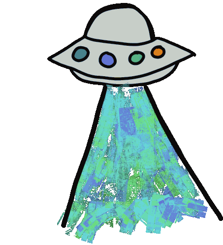
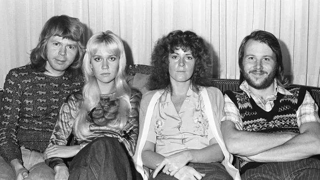

Markdown

# Presentación del Proyecto 👽 

**Autor:** [Pablo Andrés Bueno Cerón]



## Descripción

Este es el repositorio para la Tarea 1 del curso. El objetivo es 
demostrar el flujo de trabajo básico con Git y GitHub.

## Pasos Realizados

1. Creación del repositorio local.

2. Creación de este archivo ``presentacion.md``.

3. Conexión con GitHub.

## Herramientas Utilizadas

| Herramientas | Uso |
|--------------|-----|
| Git Bash| Control de versiones|
| GitHub | Repositorio remoto |
| Maekdown | Documentación |

## Code
``` javascript
# Comandos usados en Git Bash 
git status
git add
git commit -m "Mensaje commit"
git push origin main
```


# Instruciones de intalacion y uso de Markdown y Git Bash

### Instalación Markdwon en Git Bash
1. Clonar el repositorio desde GitHub:
```bash 
git clone https://github.com/PUJ-POO-20252/crear-documento-markdown-pablobuenoceron29-debug.git
```

## Como contribuye el uso de Markdown 

La herramienta **Markdown** contribuye al uso adecuado de la información 
en espacios de repositorios muy utilizados por la comunidad de *Programador/Ingenieros*. 
Permitiendo contar un entorno donde el contenido puede presentar de forma **grafica, ordenada y estructura**, facilitando la exposición
del trabajo realizando. En el contexto de **GitHub, Markdown** ayuda a documentar proyectos
de manera clara y accesible, lo que mejora la compresión del codigo, la colaboración entre desarrolladores
y la facilidad de uso del repositorio para cualquier persona que lo consulte.

# Bigiofia personal 😼

Me presento mi nombre es **Pablo Andrés Bueno Cerón** estudiante de Ingeneria Sistemas y Computación, tengo 20 años de edad
estudiante de 2 semestre de la **Potificia Universidad Javeriana** soy alguien que le aposiona las tecnologías emergentes como el
uso de herramientas inteligentes "IA" o tecnologías realidad aumentada, y aficionada a todo lo que tenga que ver con la *computer security*
con casos relacionados como: Caso Pegaus, Caso de Edward Snowden, en otros.


## Playlist

Aquí hay una Playlist pequeña de algunas canciónes que me gusta escuchar cuando estudio 👾

### ABBA - The Winner

[Ver video](https://youtu.be/92cwKCU8Z5c?si=C4_sYcJFLTy4U7rm)



---

### Bilie Eilish - BIRDS OF A FEATHER
 
[Ver video](https://youtu.be/V9PVRfjEBTI?si=zIEGg9q8-7ZCJ76G)

.jpg)

---

### Lana Del Rey - Summertime Sadness

[Ver video](https://youtu.be/TdrL3QxjyVw?si=hwiWTl_nvAvR95MU)


